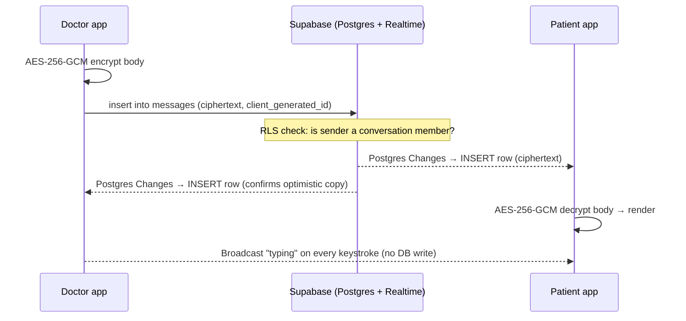
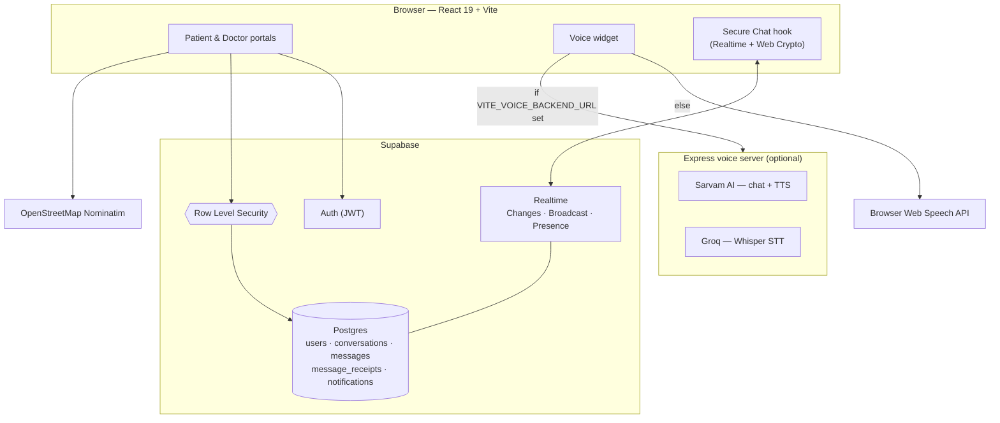

<div align="center">

# 🏥 MyHospital

### Top-tier medical care, delivered to the village — from a phone.

MyHospital is a telehealth platform built for NGOs working in under-served regions.
It puts a patient in the same room as a leading doctor without either of them
travelling: a triage-aware clinician workspace, a friendly patient portal, a
multilingual voice assistant, explainable-AI health insights, and an
**end-to-end access-controlled, real-time Secure Chat**.

<br/>

`React 19` · `Vite 6` · `TypeScript` · `Tailwind v4` · `Supabase (Auth · Postgres · Realtime)` · `Express` · `Sarvam AI` · `Groq`

</div>

---

## Table of contents

- [Why MyHospital](#why-myhospital)
- [Feature tour](#feature-tour)
- [Secure Chat — the flagship](#secure-chat--the-flagship)
- [Architecture](#architecture)
- [Tech stack](#tech-stack)
- [Repository layout](#repository-layout)
- [Getting started](#getting-started)
- [Environment variables](#environment-variables)
- [Supabase setup](#supabase-setup)
- [Security model](#security-model)
- [Roadmap](#roadmap)
- [Scripts](#scripts)
- [License](#license)

---

## Why MyHospital

Millions of people live hours from the nearest specialist. NGOs already have the
trust and the field presence in those communities — what they lack is the
software layer that lets a volunteer health worker, a patient, and a
metropolitan doctor collaborate in real time.

MyHospital is that layer:

| For the patient | For the doctor | For the NGO |
|---|---|---|
| A phone-first portal in their own language | A triage queue that surfaces the sickest person first | One roster, full audit trail |
| Vitals, records, appointments in one place | Patient management with adherence & priority signals | Row-level-security isolation between care networks |
| Plain-language explanations of every AI insight | Secure messaging with typing & presence | No plaintext messages at rest |

---

## Feature tour

### 👤 Patient portal  &nbsp;`/patient/*`

| Page | What it does |
|---|---|
| **Home** | Snapshot of vitals trend, upcoming appointments, unread messages |
| **Secure Chat** | Real-time, encrypted 1-to-1 messaging with the care team |
| **Consultation** | Book a video or in-person slot with a chosen doctor |
| **Vitals** | Heart rate, blood pressure, SpO₂, glucose — rings + history charts |
| **Medical Records** | Documents, prescriptions and lab results |
| **XAI Help** | Every AI suggestion shown as a reasoning graph + confidence ring, with a plain-language summary and thumbs up/down feedback |

### 🩺 Clinician portal  &nbsp;`/doctor/*`

| Page | What it does |
|---|---|
| **Home** | Live triage queue ranked `critical → urgent → moderate → stable`, wait times, workload charts |
| **Secure Chat** | Same messaging surface, doctor side; start a new thread with any patient |
| **Managing Patients** | Full patient list with condition, adherence %, next appointment, status filters |
| **Consultation** | Run the current consult — notes, vitals, next steps |
| **Appointments** | Day/week schedule management |

### 🎙️ Multilingual voice assistant

A floating mascot on **every page**. Ask a question by voice or text in **9 Indian
languages** (Hindi, English, Tamil, Telugu, Bengali, Malayalam, Kannada, Marathi,
Gujarati).

- **With the backend running** → Sarvam AI for chat + natural TTS, Groq Whisper for speech-to-text.
- **Without it** → falls back to the browser's built-in Web Speech APIs, so it still works offline-ish and on a free tier.

### 🌍 Address & geolocation

Free-text address → coordinates via OpenStreetMap **Nominatim**, rendered on a
**Leaflet** map — no API key, no vendor lock-in.

---

## Secure Chat — the flagship

Real-time doctor ↔ patient messaging, built entirely on **Supabase Realtime** with
**zero plaintext at rest**.

### What you get

- **Instant delivery** — messages appear on the other device in ~100 ms.
- **"… is typing"** — animated, debounced, and completely ephemeral.
- **Presence** — a live online/offline dot for the other participant.
- **Optimistic send** — your message shows immediately, reconciles when persisted.
- **Idempotent writes** — a unique `(conversation_id, client_generated_id)` index means a retry after a flaky network never double-posts.
- **Client-side encryption** — AES-256-GCM on the message body before it leaves the browser.
- **Row-level security** — the database itself refuses to return a message to anyone who isn't a participant.

### How the three Realtime channels are used

| Concern | Realtime feature | Touches the DB? |
|---|---|---|
| Message history & delivery | **Postgres Changes** on `public.messages` (RLS-scoped) | ✅ persisted |
| "… is typing" | **Broadcast** (`typing` / `stop_typing`) | ❌ never |
| Online / last-seen | **Presence** | ❌ never |

### Message lifecycle



### Encryption details

- **Algorithm:** AES-256-GCM (Web Crypto), fresh 12-byte IV per message.
- **Stored form:** `enc.v1.<base64(iv)>.<base64(ciphertext+tag)>` in `messages.content`.
- **Backwards compatible:** rows without the `enc.v1.` prefix are treated as legacy plaintext and passed through, so the feature can be switched on with no data migration.
- **Key:** a single 256-bit app key in `VITE_CHAT_ENC_KEY`, shared by both portals (they're the same build).

> **Threat model — read this.** Because Vite inlines `VITE_*` variables, the key
> ships inside the client bundle. This keeps plaintext out of the database,
> backups, logs, and the planned MongoDB mirror — it is **not** end-to-end
> encryption and does not stop a determined signed-in user from extracting the
> key. True E2EE would require per-user keypairs (e.g. libsodium sealed boxes)
> and giving up server-side search. See the [Roadmap](#roadmap).

Relevant code: [`src/lib/crypto.ts`](frontend/src/lib/crypto.ts),
[`src/lib/chat.ts`](frontend/src/lib/chat.ts),
[`src/lib/useSecureChat.ts`](frontend/src/lib/useSecureChat.ts),
[`src/components/SecureChatView.tsx`](frontend/src/components/SecureChatView.tsx).

---

## Architecture



- **No custom application server for core features.** The React app talks
  straight to Supabase; RLS is the security boundary.
- **The Express backend is optional** and isolated — it only powers the voice
  assistant and holds the Sarvam/Groq keys server-side.

---

## Tech stack

| Layer | Choice | Notes |
|---|---|---|
| UI framework | **React 19**, React Router 7 | SPA, route-per-portal-page |
| Build | **Vite 6**, TypeScript 5.8 | `@vitejs/plugin-react` |
| Styling | **Tailwind CSS v4** (`@tailwindcss/vite`) + hand-authored `dashboard.css` | design tokens in `index.css` |
| Icons | `lucide-react` | |
| 3D | `three` | landing & auth scenes |
| Maps | `leaflet` + OSM Nominatim | address capture |
| Graphs | `dagre` | XAI reasoning graph layout |
| Auth / DB / Realtime | **Supabase** (`@supabase/supabase-js` v2) | Postgres 17 |
| Crypto | Web Crypto API | AES-256-GCM message bodies |
| Voice backend | **Express 4** (CommonJS) | Sarvam AI + Groq, `multer`, `cors` |

---

## Repository layout

```
MyHospital/
├── frontend/                     # React + Vite app
│   ├── src/
│   │   ├── pages/
│   │   │   ├── Landing/          # public landing (3D stethoscope scene)
│   │   │   ├── Healthcare/       # login / signup + 3D scene
│   │   │   ├── Patient/          # patient portal pages + nav
│   │   │   └── Doctor/           # clinician portal pages + nav
│   │   ├── components/
│   │   │   ├── DashboardLayout.tsx   # shared portal shell
│   │   │   ├── SecureChatView.tsx    # the live chat UI
│   │   │   ├── charts/               # Line/Bar/ConfidenceRing/ReasoningGraph
│   │   │   └── dashboard.css
│   │   ├── lib/
│   │   │   ├── supabaseClient.ts     # configured Supabase client
│   │   │   ├── useProfile.ts         # signed-in user + role
│   │   │   ├── chat.ts               # Secure Chat data layer
│   │   │   ├── useSecureChat.ts      # Secure Chat realtime hook
│   │   │   ├── crypto.ts             # AES-256-GCM envelope
│   │   │   ├── geocode.ts            # Nominatim wrapper
│   │   │   ├── notifications.ts      # notifications data layer
│   │   │   └── priority.ts           # triage priority scale
│   │   └── voice-widget/             # self-contained voice assistant
│   └── vite.config.ts
│
└── backend/                      # optional Express voice server
    ├── server.js
    ├── config.js                # models + 9 supported languages
    ├── rate-limit.js
    └── routes/  (tts.js · stt.js · chat.js)
```

---

## Getting started

### Prerequisites

- **Node.js ≥ 18** (backend engines field), 20+ recommended for the frontend
- A **Supabase project** (free tier is fine)
- *(optional)* **Sarvam AI** and **Groq** API keys for the full voice assistant

### 1. Frontend

```bash
cd frontend
npm install
cp .env.example .env      # if present; otherwise create .env (see below)
npm run dev               # http://localhost:5173
```

### 2. Backend *(optional — voice assistant)*

```bash
cd backend
npm install
cp .env.example .env      # fill SARVAM_API_KEY and GROQ_API_KEY
npm run dev               # http://localhost:8787 (see config.js) — /api/health to check
```

If you skip the backend, leave `VITE_VOICE_BACKEND_URL` unset and the widget uses
the browser's speech APIs.

---

## Environment variables

### `frontend/.env`

| Variable | Required | Purpose |
|---|:--:|---|
| `VITE_SUPABASE_URL` | ✅ | Supabase project URL |
| `VITE_SUPABASE_ANON_KEY` | ✅ | Supabase anon / publishable key (safe in the browser; RLS enforces access) |
| `VITE_CHAT_ENC_KEY` | ✅ for Secure Chat | Base64 256-bit AES key. Generate: `node -e "console.log(require('crypto').randomBytes(32).toString('base64'))"` — same value in every deployment; **never commit it**. Until it's set, messages store as plaintext. |
| `VITE_VOICE_BACKEND_URL` | ⬜ | URL of the Express voice server. Unset → browser-only voice fallback. |

### `backend/.env`

| Variable | Required | Purpose |
|---|:--:|---|
| `SARVAM_API_KEY` | ✅ | Sarvam AI — multilingual chat + TTS |
| `GROQ_API_KEY` | ✅ | Groq — Whisper speech-to-text |
| `PORT` | ⬜ | Defaults in `config.js` |
| `SARVAM_TTS_MODEL` / `SARVAM_STT_MODEL` / `SARVAM_CHAT_MODEL` / `GROQ_STT_MODEL` / `DEFAULT_LANG` | ⬜ | Model + language overrides |

> `.env`, `.env.local`, `node_modules`, `dist`, `.vite` are git-ignored.

---

## Supabase setup

### Tables (schema `public`)

| Table | Purpose | RLS |
|---|---|---|
| `users` | Profile row per auth user — `name`, `email`, `role` (`doctor` \| `patient`), `address`, `latitude`, `longitude` | own row; **chat partners** may read each other; **doctors** may list patients |
| `conversations` | One doctor ↔ patient thread — `doctor_id`, `patient_id`, `status`, `subject`, `last_message_at`; unique on `(doctor_id, patient_id)` | participants only; doctor creates |
| `messages` | `conversation_id`, `sender_id`, `sender_role`, `message_type`, `content` (ciphertext), `client_generated_id`, `metadata`, soft-delete via `deleted_at` | participants read; sender inserts / edits |
| `message_receipts` | Per-user `delivered_at` / `read_at` | own receipts only |
| `notifications` | In-app notifications with an urgency scale | own rows only |

**Enums:** `user_role`, `conversation_status`, `participant_role`, `message_type`

**Functions / triggers:**
`is_conversation_member(uuid)`, `current_user_role()`, `shares_conversation_with(uuid)`
(all `security definer` to avoid RLS recursion), and `bump_conversation()` — an
`after insert on messages` trigger that keeps `conversations.last_message_at` fresh.

### Realtime

The `supabase_realtime` publication includes `messages` and `message_receipts`.
Realtime honours RLS, so each client only receives rows for its own
conversations. Broadcast/Presence channels are `sc:inbox` and `sc:conv:<id>`.

### Applied migrations

| Migration | What it did |
|---|---|
| `conversations_fk_to_public_users` | Repointed `doctor_id` / `patient_id` FKs from `auth.users` → `public.users` so PostgREST can embed the peer's name & role in one query |
| `users_visibility_for_secure_chat` | Added `current_user_role()` + `shares_conversation_with()` helpers and two SELECT policies: chat partners can read each other's profile; doctors can browse patient rows to start a thread |

### Trying Secure Chat locally

1. Create **one `doctor`** and **one `patient`** account (role set at sign-up).
2. Sign in as each in two browsers / a private window.
3. As the doctor, hit **+** in the Conversations header, pick the patient.
4. Type on one side — the other shows "… is typing"; send — it lands live on both.

Only doctors can open a conversation (there is no patient `INSERT` policy on
`conversations`, by design).

---

## Security model

| Boundary | Mechanism |
|---|---|
| Who can read a message | Postgres **RLS** — `messages` SELECT policy requires `is_conversation_member(conversation_id)`; enforced for both REST and Realtime |
| Who can send a message | RLS INSERT policy — `sender_id = auth.uid()` **and** a conversation member |
| Message content at rest | **AES-256-GCM** client-side; Postgres and the future Mongo mirror only ever hold ciphertext |
| Cross-network isolation | Every table RLS-scoped to the signed-in user; no service-role key in the browser |
| Voice / AI keys | Held only by the Express backend, never shipped to the client |
| Address lookups | Anonymous, keyless Nominatim requests |

**Known limitation:** `VITE_CHAT_ENC_KEY` is bundled into the client, so the
encryption protects at-rest storage, not against a malicious authenticated user.

---

## Roadmap

- [ ] **MongoDB history store** (Mongoose) — archival chat logs, full-text search, and access-audit trail, fed by a Supabase Database Webhook → ingest endpoint (idempotent upsert on `messages.id`). Postgres already stores only ciphertext, so the mirror inherits that.
- [ ] **Read receipts in the UI** — `message_receipts` is wired on the write side; surface ticks in `SecureChatView`.
- [ ] **Attachments** — `message_type` already supports `image` / `file`; add Supabase Storage + signed URLs.
- [ ] **True E2EE option** — per-user X25519 keypairs, sealed-box message bodies.
- [ ] **Replace mocked dashboard data** — Home / Vitals / Records / Appointments currently render illustrative fixtures; back them with real tables.
- [ ] **Push notifications** for new messages when the app is backgrounded.

---

## Scripts

### `frontend/`

| Command | Description |
|---|---|
| `npm run dev` | Vite dev server with HMR |
| `npm run build` | `tsc` type-check + production build to `dist/` |
| `npm run preview` | Serve the production build locally |

### `backend/`

| Command | Description |
|---|---|
| `npm run dev` | `node --watch server.js` |
| `npm start` | `node server.js` |

---

## License

See [`LICENSE`](LICENSE).

<div align="center"><sub>Built so that where you live stops deciding how well you're cared for.</sub></div>
