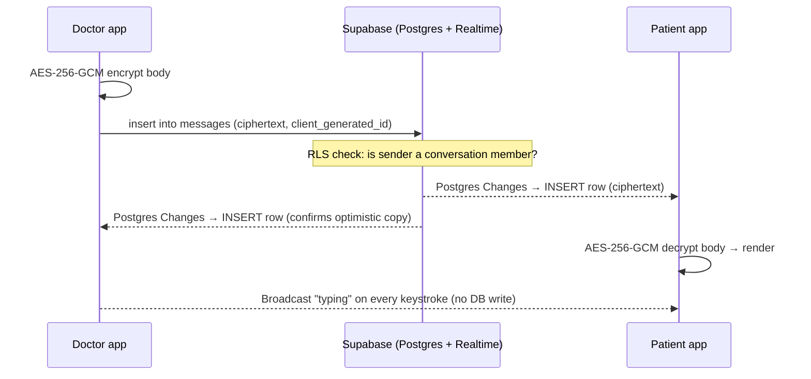
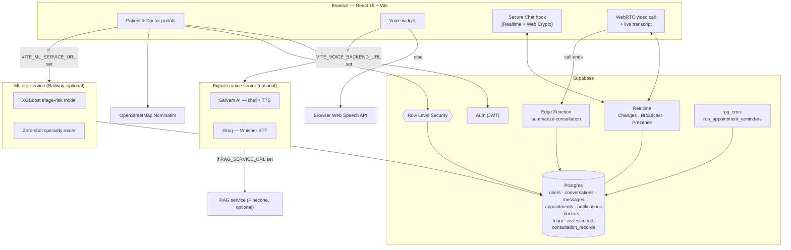

<div align="center">

# 🏥 MyHospital

### Top-tier medical care, delivered to the village — from a phone.

MyHospital is a telehealth platform built for NGOs working in under-served regions.
It puts a patient in the same room as a leading doctor without either of them
travelling: a triage-aware clinician workspace, a friendly patient portal, a
multilingual voice assistant, explainable-AI health insights, and an
**end-to-end access-controlled, real-time Secure Chat**.

<br/>

`React 19` · `Vite 6` · `TypeScript` · `Tailwind v4` · `Supabase (Auth · Postgres · Realtime)` · `Express` · `Sarvam AI` · `Groq` · `XGBoost / FastAPI` · `Pinecone RAG`

</div>

---

## Table of contents

- [Why MyHospital](#why-myhospital)
- [Feature tour](#feature-tour)
- [Secure Chat — the flagship](#secure-chat--the-flagship)
- [ML triage-risk & specialty routing](#ml-triage-risk--specialty-routing)
- [RAG-grounded voice assistant](#rag-grounded-voice-assistant)
- [Architecture](#architecture)
- [Tech stack](#tech-stack)
- [Repository layout](#repository-layout)
- [Getting started](#getting-started)
- [Environment variables](#environment-variables)
- [Supabase setup](#supabase-setup)
- [Security model](#security-model)
- [Roadmap](#roadmap)
- [Scripts](#scripts)
- [License](#license)

---

## Why MyHospital

Millions of people live hours from the nearest specialist. NGOs already have the
trust and the field presence in those communities — what they lack is the
software layer that lets a volunteer health worker, a patient, and a
metropolitan doctor collaborate in real time.

MyHospital is that layer:

| For the patient | For the doctor | For the NGO |
|---|---|---|
| A phone-first portal in their own language | A triage queue that surfaces the sickest person first | One roster, full audit trail |
| Vitals, records, appointments in one place | Patient management with adherence & priority signals | Row-level-security isolation between care networks |
| Plain-language explanations of every AI insight | Secure messaging with typing & presence | No plaintext messages at rest |

---

## Feature tour

### 👤 Patient portal  &nbsp;`/patient/*`

| Page | What it does |
|---|---|
| **Home** | Snapshot of vitals trend, upcoming appointments, unread messages |
| **Secure Chat** | Real-time, encrypted 1-to-1 messaging with the care team |
| **Appointments** | Request, reschedule, or cancel a visit with a chosen doctor — backed by `public.appointments`, not mock data |
| **Video call** | In-browser WebRTC consultation (peer-to-peer, no media server); live captioned transcript |
| **Vitals** | Heart rate, blood pressure, SpO₂, glucose — rings + history charts |
| **Medical Records** | Documents, prescriptions, lab results, **and past consultation records** (AI summary + transcript, downloadable as PDF/TXT) |
| **XAI Help** | Every AI suggestion shown as a reasoning graph + confidence ring, with a plain-language summary and thumbs up/down feedback |

### 🩺 Clinician portal  &nbsp;`/doctor/*`

| Page | What it does |
|---|---|
| **Home** | Live triage queue ranked `critical → urgent → moderate → stable`, wait times, workload charts |
| **Secure Chat** | Same messaging surface, doctor side; start a new thread with any patient |
| **Managing Patients** | A **live, priority-ordered panel** (`doctor_patient_panel()` RPC) — every triage assessment auto-routes a patient to a doctor and keeps urgency fresh via the `triage_shift_patient` trigger, so the list is never hand-maintained |
| **Appointments** | Day/week schedule management against `public.appointments`; confirm/decline requests |
| **Video call** | Run the current consult over WebRTC; live transcript captured locally, then AI-summarised into the record when the call ends |

### 🎙️ Multilingual voice assistant

A floating mascot on **every page**. Ask a question by voice or text in **9 Indian
languages** (Hindi, English, Tamil, Telugu, Bengali, Malayalam, Kannada, Marathi,
Gujarati).

- **With the backend running** → Sarvam AI for chat + natural TTS, Groq Whisper for speech-to-text.
- **Without it** → falls back to the browser's built-in Web Speech APIs, so it still works offline-ish and on a free tier.

### 🌍 Address & geolocation

Free-text address → coordinates via OpenStreetMap **Nominatim**, rendered on a
**Leaflet** map — no API key, no vendor lock-in. The same profile panel takes a
**mobile number** (`+91`); with the SMS bridge enabled server-side, every
in-app notification is mirrored to that number as a text, plus a 06:00 IST
daily "log your vitals" reminder. Ships **disabled** (SMS is billable) — see
[Supabase setup](#supabase-setup).

---

## Secure Chat — the flagship

Real-time doctor ↔ patient messaging, built entirely on **Supabase Realtime** with
**zero plaintext at rest**.

### What you get

- **Instant delivery** — messages appear on the other device in ~100 ms.
- **"… is typing"** — animated, debounced, and completely ephemeral.
- **Presence** — a live online/offline dot for the other participant.
- **Optimistic send** — your message shows immediately, reconciles when persisted.
- **Idempotent writes** — a unique `(conversation_id, client_generated_id)` index means a retry after a flaky network never double-posts.
- **Client-side encryption** — AES-256-GCM on the message body before it leaves the browser.
- **Row-level security** — the database itself refuses to return a message to anyone who isn't a participant.

### How the three Realtime channels are used

| Concern | Realtime feature | Touches the DB? |
|---|---|---|
| Message history & delivery | **Postgres Changes** on `public.messages` (RLS-scoped) | ✅ persisted |
| "… is typing" | **Broadcast** (`typing` / `stop_typing`) | ❌ never |
| Online / last-seen | **Presence** | ❌ never |

### Message lifecycle



### Encryption details

- **Algorithm:** AES-256-GCM (Web Crypto), fresh 12-byte IV per message.
- **Stored form:** `enc.v1.<base64(iv)>.<base64(ciphertext+tag)>` in `messages.content`.
- **Backwards compatible:** rows without the `enc.v1.` prefix are treated as legacy plaintext and passed through, so the feature can be switched on with no data migration.
- **Key:** a single 256-bit app key in `VITE_CHAT_ENC_KEY`, shared by both portals (they're the same build).

> **Threat model — read this.** Because Vite inlines `VITE_*` variables, the key
> ships inside the client bundle. This keeps plaintext out of the database,
> backups, logs, and the planned MongoDB mirror — it is **not** end-to-end
> encryption and does not stop a determined signed-in user from extracting the
> key. True E2EE would require per-user keypairs (e.g. libsodium sealed boxes)
> and giving up server-side search. See the [Roadmap](#roadmap).

Relevant code: [`src/lib/crypto.ts`](frontend/src/lib/crypto.ts),
[`src/lib/chat.ts`](frontend/src/lib/chat.ts),
[`src/lib/useSecureChat.ts`](frontend/src/lib/useSecureChat.ts),
[`src/components/SecureChatView.tsx`](frontend/src/components/SecureChatView.tsx).

---

## ML triage-risk & specialty routing

A standalone **FastAPI service** (`ml/`) that turns a patient's vitals,
presenting complaint, and history into an actual clinical priority — replacing
what would otherwise be a hand-maintained "who's sickest" list.

- **Model:** XGBoost regressor trained on 560K+ real ED visits
  ([Kaggle: Hospital Triage and Patient History Data](https://www.kaggle.com/datasets/maalona/hospital-triage-and-patient-history-data)),
  predicting an inverted **ESI** (Emergency Severity Index) so higher output =
  higher urgency. ~570 input features (7 triage vitals + chief-complaint /
  medical-history / prior-utilization flags); anything a caller omits is
  imputed the way training data's missing values were.
- **`POST /route`** — free-text complaint → specialty (via a zero-shot
  DistilBERT/MNLI entailment classifier, *not* an LLM) + risk score + a
  `critical / urgent / moderate / stable` need bracket. The result is
  persisted to `triage_assessments`, and `match_doctors()` ranks in-specialty
  doctors so higher-need patients land with the most experienced, least-loaded
  one. This is what feeds the doctor panel's `triage_shift_patient` trigger.
- **`POST /explain`** — real per-prediction SHAP contributions (not mock
  data), rendered by the patient-facing **XAI Help** reasoning graph.
- **`POST /prioritize`** — a patient list, ranked.

Frontend glue: [`frontend/src/lib/triage.ts`](frontend/src/lib/triage.ts)
(`routePatient()`), [`frontend/src/lib/riskModel.ts`](frontend/src/lib/riskModel.ts)
(`/explain`). Deploys as a Docker image to Railway
(root directory `ml/`) — see [`ml/README.md`](ml/README.md) for the full
dataset/training/deploy writeup.

---

## RAG-grounded voice assistant

`rag-system/` is a small local service that grounds the voice assistant's
chat answers in this project's own docs, instead of letting it hallucinate
about the product.

- Embeds content **locally** with `Xenova/multilingual-e5-small` (no
  embedding API cost) and stores vectors + source metadata in **Pinecone**.
- `npm run index` walks the README, frontend source, safe backend
  route/config source, and `rag-system/knowledge/` — skipping env files,
  databases, dependencies, builds, and patient data — and (re)builds the
  index whenever the product changes.
- At chat time, the Express voice backend's `chat.js` route calls
  `RAG_SERVICE_URL/retrieve` to fetch relevant chunks before asking Sarvam to
  answer — if the RAG service isn't configured or is down, the assistant
  degrades gracefully and answers without that grounding.

See [`rag-system/README.md`](rag-system/README.md) for setup.

---

## Architecture



- **No custom application server for core features.** The React app talks
  straight to Supabase; RLS is the security boundary.
- **The Express backend is optional** and isolated — it only powers the voice
  assistant and holds the Sarvam/Groq keys server-side.
- **The ML service and RAG service are separate, optional processes.** Each
  degrades gracefully when its URL env var is unset: the ML-dependent UI
  (triage routing, XAI explanations) simply has nothing to call, and the
  voice assistant answers without RAG grounding.
- `backend/appointments-server.js` (Mongoose/MongoDB) is **legacy and
  unused** — appointments now live in `public.appointments` on Supabase; see
  [`frontend/src/lib/appointments.ts`](frontend/src/lib/appointments.ts).

---

## Tech stack

| Layer | Choice | Notes |
|---|---|---|
| UI framework | **React 19**, React Router 7 | SPA, route-per-portal-page |
| Build | **Vite 6**, TypeScript 5.8 | `@vitejs/plugin-react` |
| Styling | **Tailwind CSS v4** (`@tailwindcss/vite`) + hand-authored `dashboard.css` | design tokens in `index.css` |
| Icons | `lucide-react` | |
| 3D | `three` | landing & auth scenes |
| Maps | `leaflet` + OSM Nominatim | address capture |
| Graphs | `dagre` | XAI reasoning graph layout |
| Auth / DB / Realtime | **Supabase** (`@supabase/supabase-js` v2) | Postgres 17 |
| Crypto | Web Crypto API | AES-256-GCM message bodies |
| Video calls | **WebRTC** (native browser API) | P2P, Supabase Realtime broadcast for signaling, Google STUN only |
| Voice backend | **Express 4** (CommonJS) | Sarvam AI + Groq, `multer`, `cors` |
| Triage risk model | **XGBoost**, FastAPI, Python | trained on 560K+ ED visits; deployed to Railway |
| Specialty routing | `typeform/distilbert-base-uncased-mnli` (zero-shot) | via `transformers`, HF hub |
| Consultation AI summary | Supabase Edge Function + **Groq** (`llama-3.1-8b`) | `summarize-consultation`, free tier |
| RAG grounding | **Pinecone** + `Xenova/multilingual-e5-small` (local embeddings) | feeds voice-assistant chat context |
| PDF export | `jspdf` + `jspdf-autotable` | consultation record download |
| Data fetching | `@tanstack/react-query` | appointments, panel, notifications, consultations |

---

## Repository layout

```
MyHospital/
├── frontend/                     # React + Vite app
│   ├── src/
│   │   ├── pages/
│   │   │   ├── Landing/          # public landing (3D stethoscope scene)
│   │   │   ├── Healthcare/       # login / signup + 3D scene
│   │   │   ├── Patient/          # patient portal pages + nav
│   │   │   ├── Doctor/           # clinician portal pages + nav
│   │   │   └── shared/           # VideoCall.tsx, ConsultationRecord.tsx — used by both portals
│   │   ├── components/
│   │   │   ├── DashboardLayout.tsx   # shared portal shell
│   │   │   ├── SecureChatView.tsx    # the live chat UI
│   │   │   ├── charts/               # Line/Bar/ConfidenceRing/ReasoningGraph
│   │   │   └── dashboard.css
│   │   ├── lib/
│   │   │   ├── supabaseClient.ts     # configured Supabase client
│   │   │   ├── useProfile.ts         # signed-in user + role
│   │   │   ├── formatName.ts         # "Dr. X" display-name helpers
│   │   │   ├── chat.ts               # Secure Chat data layer
│   │   │   ├── useSecureChat.ts      # Secure Chat realtime hook
│   │   │   ├── crypto.ts             # AES-256-GCM envelope
│   │   │   ├── geocode.ts            # Nominatim wrapper
│   │   │   ├── notifications.ts      # notifications data layer
│   │   │   ├── priority.ts           # triage priority scale
│   │   │   ├── appointments.ts       # appointments data layer (public.appointments)
│   │   │   ├── panel.ts              # doctor priority panel (doctor_patient_panel() RPC)
│   │   │   ├── triage.ts             # ML /route call → specialty + risk + doctor match
│   │   │   ├── riskModel.ts          # ML /explain call → SHAP factors for XAI Help
│   │   │   ├── webrtc.ts             # P2P video call (Realtime signaling)
│   │   │   ├── useCallTranscript.ts  # live Web Speech transcript during a call
│   │   │   ├── consultations.ts      # consultation records + summarize-consultation trigger
│   │   │   ├── consultationDoc.ts    # jsPDF / .txt export of a consultation record
│   │   │   └── api.ts                # legacy fetch wrapper for backend/appointments-server.js (unused)
│   │   └── voice-widget/             # self-contained voice assistant
│   └── vite.config.ts
│
├── backend/                      # optional Express voice server
│   ├── server.js
│   ├── config.js                 # models + 9 supported languages + RAG_SERVICE_URL
│   ├── rate-limit.js
│   ├── routes/  (tts.js · stt.js · chat.js)
│   ├── appointments-server.js    # legacy Mongoose/MongoDB service — superseded by Supabase, unused
│   ├── models/Appointment.js     # legacy Mongoose schema
│   ├── middleware/auth.js        # legacy JWT middleware
│   └── scripts/  (check-db.js · seed.js)
│
├── ml/                            # optional FastAPI triage-risk + specialty-routing service
│   ├── service/                  # inference API — the deployable unit (Railway)
│   ├── weights/                  # model.joblib + metrics.json
│   ├── src/                      # training pipeline (needs database/, gitignored raw data)
│   └── Dockerfile, railway.toml
│
└── rag-system/                    # optional local-embeddings + Pinecone retrieval service
    └── src/  (index-website.js · server.js · embed.js · retrieve.js · pinecone.js)
```

---

## Getting started

### Prerequisites

- **Node.js ≥ 18** (backend engines field), 20+ recommended for the frontend
- A **Supabase project** (free tier is fine)
- *(optional)* **Sarvam AI** and **Groq** API keys for the full voice assistant

### 1. Frontend

```bash
cd frontend
npm install
cp .env.example .env      # if present; otherwise create .env (see below)
npm run dev               # http://localhost:5173
```

### 2. Backend *(optional — voice assistant)*

```bash
cd backend
npm install
cp .env.example .env      # fill SARVAM_API_KEY and GROQ_API_KEY
npm run dev               # http://localhost:8787 (see config.js) — /api/health to check
```

If you skip the backend, leave `VITE_VOICE_BACKEND_URL` unset and the widget uses
the browser's speech APIs.

### 3. ML risk service *(optional — triage routing, XAI explanations)*

```bash
cd ml
python -m venv .venv && .venv/Scripts/activate   # or source .venv/bin/activate on macOS/Linux
pip install -r service/requirements.txt
uvicorn service.main:app --reload                # http://localhost:8000 — /health to check
```

If you skip it, leave `VITE_ML_SERVICE_URL` unset — specialty routing and
XAI "why" explanations simply won't be available. See
[`ml/README.md`](ml/README.md) to also retrain the model.

### 4. RAG system *(optional — grounds the voice assistant in this repo's docs)*

```bash
cd rag-system
npm install
cp .env.example .env      # add a Pinecone API key
npm run index              # builds the vector index
npm start                  # http://localhost:8790
```

Then set `RAG_SERVICE_URL=http://localhost:8790` in `backend/.env`. See
[`rag-system/README.md`](rag-system/README.md).

---

## Environment variables

### `frontend/.env`

| Variable | Required | Purpose |
|---|:--:|---|
| `VITE_SUPABASE_URL` | ✅ | Supabase project URL |
| `VITE_SUPABASE_ANON_KEY` | ✅ | Supabase anon / publishable key (safe in the browser; RLS enforces access) |
| `VITE_CHAT_ENC_KEY` | ✅ for Secure Chat | Base64 256-bit AES key. Generate: `node -e "console.log(require('crypto').randomBytes(32).toString('base64'))"` — same value in every deployment; **never commit it**. Until it's set, messages store as plaintext. |
| `VITE_VOICE_BACKEND_URL` | ⬜ | URL of the Express voice server. Unset → browser-only voice fallback. |
| `VITE_ML_SERVICE_URL` | ⬜ | URL of the FastAPI risk service. Unset → defaults to `http://localhost:8000`; unreachable → specialty routing & XAI explanations are unavailable. |

### `backend/.env`

| Variable | Required | Purpose |
|---|:--:|---|
| `SARVAM_API_KEY` | ✅ | Sarvam AI — multilingual chat + TTS |
| `GROQ_API_KEY` | ✅ | Groq — Whisper speech-to-text |
| `PORT` | ⬜ | Defaults in `config.js` |
| `SARVAM_TTS_MODEL` / `SARVAM_STT_MODEL` / `SARVAM_CHAT_MODEL` / `GROQ_STT_MODEL` / `DEFAULT_LANG` | ⬜ | Model + language overrides |
| `RAG_SERVICE_URL` | ⬜ | URL of the RAG system's `/retrieve` endpoint. Unset → chat answers without website-doc grounding. |
| `RAG_TIMEOUT_MS` | ⬜ | Defaults to `5000` |

### `rag-system/.env`

| Variable | Required | Purpose |
|---|:--:|---|
| `PINECONE_API_KEY` | ✅ | Vector store for indexed doc chunks |

> `.env`, `.env.local`, `node_modules`, `dist`, `.vite` are git-ignored.
>
> **Supabase Edge Function secrets** (set via the Supabase dashboard/CLI, not
> a local `.env`):
> - `summarize-consultation` needs its own `GROQ_API_KEY` to call Groq's free
>   `llama-3.1-8b` for consultation summaries.
> - `send-sms` (the notification → SMS bridge, **shipped disabled** — see
>   Supabase setup) reads, when you enable it: `SMS_PROVIDER` (`fast2sms` \|
>   `twilio`), then either `FAST2SMS_API_KEY`, or `TWILIO_ACCOUNT_SID` +
>   `TWILIO_AUTH_TOKEN` + `TWILIO_FROM_NUMBER`. With none set it no-ops and
>   logs. Optional `SMS_SHARED_SECRET` — when set, the DB trigger must present
>   it as `x-sms-secret`. **No SMS keys live in the repo.**

---

## Supabase setup

### Tables (schema `public`)

| Table | Purpose | RLS |
|---|---|---|
| `users` | Profile row per auth user — `name`, `email`, `role` (`doctor` \| `patient`), `address`, `latitude`, `longitude`, `phone` (patient mobile for SMS alerts, +91 assumed) | own row; **chat partners** may read each other; **doctors** may list patients |
| `conversations` | One doctor ↔ patient thread — `doctor_id`, `patient_id`, `status`, `subject`, `last_message_at`; unique on `(doctor_id, patient_id)` | participants only; doctor creates |
| `messages` | `conversation_id`, `sender_id`, `sender_role`, `message_type`, `content` (ciphertext), `client_generated_id`, `metadata`, soft-delete via `deleted_at` | participants read; sender inserts / edits |
| `message_receipts` | Per-user `delivered_at` / `read_at` | own receipts only |
| `notifications` | Real, trigger-fed notification feed — `type`, `read_at`, `link`, `metadata`, `actor_id`, urgency scale | own rows only |
| `appointments` | Full lifecycle `requested → confirmed/declined → completed/cancelled/no_show`; `appointment_type` enum, `mode` (`in_person`/`video`), per-row `meeting_room` slug, denormalized `doctor_name`/`patient_name` | both parties |
| `doctors` | One profile row per doctor user — `specialty` enum, workload | read by patients/doctors as needed |
| `patients` | `priority_bracket` / `priority_score` (0–100) / `priority_updated_at` / `latest_complaint`, `chronic_conditions`; unique on `user_id` | doctor-scoped via panel RPC |
| `triage_assessments` | Persisted result of an ML `/route` call — specialty, risk score, need bracket, `assigned_doctor_id` / `matched_doctor_ids` | doctors, by specialty match |
| `consultation_records` | One row per video visit — `transcript` text, `summary` jsonb, `summary_text`, `status` (`draft`/`final`), `summary_status` (`pending`/`ready`/`failed`/`skipped`) | both parties read; doctor inserts/updates |

**Enums:** `user_role`, `conversation_status`, `participant_role`, `message_type`,
`appointment_type`, plus the specialty/status enums under `doctors` /
`triage_assessments`.

**Functions / triggers:**
- `is_conversation_member(uuid)`, `current_user_role()`, `shares_conversation_with(uuid)`
  (all `security definer` to avoid RLS recursion), and `bump_conversation()` — an
  `after insert on messages` trigger that keeps `conversations.last_message_at` fresh.
- `appointments_denormalize` — keeps `appointments.doctor_name`/`patient_name` in sync.
- `notify_user()` (`security definer`), fired by `appointments_notify`,
  `vitals_logs_notify` (via `vitals_severity()`), `messages_notify`,
  `conversations_notify`, `users_welcome_notify` — the single write path for
  every row in `notifications`.
- `triage_shift_patient()` — `before insert` on `triage_assessments`. Resolves
  the owning doctor (`assigned_doctor_id` ?? best-matched doctor ?? least-loaded
  active doctor in the routed specialty), writes it back, and upserts `patients`
  with the normalised urgency (`risk_score * 20`, clamped 0–100) — the engine
  behind the doctor priority panel.
- `doctor_patient_panel()` — `security definer` RPC: the caller's patients,
  sorted `priority_rank(bracket)` then score desc, with next-appointment lateral
  join. Doctor RLS on `triage_assessments` is by **specialty match**, not
  assignment, which is why this RPC exists instead of a plain RLS-scoped select.
- `priority_rank(text)` — `critical`=0 … `stable`=3.
- `notifications_send_sms()` — `after insert on notifications` trigger that
  mirrors each **patient** notification (when `users.phone` is set) to SMS via
  the `send-sms` edge function over `pg_net`. **Shipped disabled** (`alter
  table … disable trigger notifications_send_sms`) because SMS is billable
  per message; re-enable the trigger to switch it on.
- `run_daily_vitals_reminder()` — inserts a `vitals_daily_reminder`
  notification for every patient (deduped per IST day); the in-app nudge is
  always on, the SMS copy follows only when the trigger above is enabled.

**Cron (`pg_cron`):**
- `appointment-reminders`, every 5 minutes, calls `run_appointment_reminders()`
  — 15-minute-out reminders + an overdue nudge.
- `daily-vitals-reminder`, `30 0 * * *` UTC (**06:00 Asia/Kolkata**), calls
  `run_daily_vitals_reminder()`.

**Edge Function:** `summarize-consultation` (`verify_jwt: true`) — loads a
`consultation_records` row under the caller's JWT, calls Groq's free
`llama-3.1-8b-instant` (OpenAI-compatible `/chat/completions`, JSON mode), and
writes the structured summary back; soft-fails to `summary_status='failed'` if
`GROQ_API_KEY` isn't set as a function secret. Invoked from
[`frontend/src/lib/consultations.ts`](frontend/src/lib/consultations.ts) when a
doctor ends a call.

**Edge Function:** `send-sms` (`verify_jwt: false`, shared-secret header) —
normalises a number to `+91XXXXXXXXXX`, sends one text via Fast2SMS or Twilio
(runtime-selected via `SMS_PROVIDER`), and no-ops with a log line when no
provider secret is set. Called only by the `notifications_send_sms` trigger,
which is disabled by default — so this stays dormant until you both add a
provider key and enable the trigger.

**Dropped:** the `patient_profile_view` view (superseded by direct table access
under RLS).

### Realtime

The `supabase_realtime` publication includes `messages`, `message_receipts`,
`appointments`, `patients`, and `consultation_records`. Realtime honours RLS,
so each client only receives rows it's allowed to see. Channels:
`sc:inbox` / `sc:conv:<id>` (Secure Chat), `rtc:<room>` (WebRTC signaling
broadcast for video calls).

### Applied migrations

| Migration | What it did |
|---|---|
| `conversations_fk_to_public_users` | Repointed `doctor_id` / `patient_id` FKs from `auth.users` → `public.users` so PostgREST can embed the peer's name & role in one query |
| `users_visibility_for_secure_chat` | Added `current_user_role()` + `shares_conversation_with()` helpers and two SELECT policies: chat partners can read each other's profile; doctors can browse patient rows to start a thread |
| *(appointments/notifications migration)* | Moved appointments off the standalone Mongo/Express service into `public.appointments`; extended `notifications`; added the notify triggers + `appointment-reminders` cron; dropped `patient_profile_view` |
| `priority_patient_panel`, `patients_user_id_unique_full`, `triage_shift_single_scale` | Added priority columns to `patients`, `triage_shift_patient()` trigger, `doctor_patient_panel()` RPC, `priority_rank()` |
| *(consultation records migration)* | Added `consultation_records` + RLS, enabled it in `supabase_realtime` |
| *(notification SMS migration)* | Added `users.phone`; `notifications_send_sms` trigger + `send-sms` edge function (notification → SMS via Fast2SMS/Twilio); `run_daily_vitals_reminder()` + `daily-vitals-reminder` cron at 06:00 IST. The SMS trigger is **left disabled** to avoid per-message cost |

### Trying Secure Chat locally

1. Create **one `doctor`** and **one `patient`** account (role set at sign-up).
2. Sign in as each in two browsers / a private window.
3. As the doctor, hit **+** in the Conversations header, pick the patient.
4. Type on one side — the other shows "… is typing"; send — it lands live on both.

Only doctors can open a conversation (there is no patient `INSERT` policy on
`conversations`, by design).

---

## Security model

| Boundary | Mechanism |
|---|---|
| Who can read a message | Postgres **RLS** — `messages` SELECT policy requires `is_conversation_member(conversation_id)`; enforced for both REST and Realtime |
| Who can send a message | RLS INSERT policy — `sender_id = auth.uid()` **and** a conversation member |
| Message content at rest | **AES-256-GCM** client-side; Postgres and the future Mongo mirror only ever hold ciphertext |
| Cross-network isolation | Every table RLS-scoped to the signed-in user; no service-role key in the browser |
| Voice / AI keys | Held only by the Express backend, never shipped to the client |
| Address lookups | Anonymous, keyless Nominatim requests |

**Known limitation:** `VITE_CHAT_ENC_KEY` is bundled into the client, so the
encryption protects at-rest storage, not against a malicious authenticated user.

---

## Roadmap

- [ ] **MongoDB history store** (Mongoose) — archival chat logs, full-text search, and access-audit trail, fed by a Supabase Database Webhook → ingest endpoint (idempotent upsert on `messages.id`). Postgres already stores only ciphertext, so the mirror inherits that.
- [ ] **Read receipts in the UI** — `message_receipts` is wired on the write side; surface ticks in `SecureChatView`.
- [ ] **Attachments** — `message_type` already supports `image` / `file`; add Supabase Storage + signed URLs.
- [ ] **True E2EE option** — per-user X25519 keypairs, sealed-box message bodies.
- [x] **Replace mocked appointments / notifications / patient panel** — `appointments`, `notifications`, and the doctor's Managing Patients queue are now backed by real Supabase tables and RPCs, not fixtures.
- [x] **Video consultations with AI-summarised records** — WebRTC calls, live transcript, `summarize-consultation` edge function, PDF/TXT export.
- [ ] **Replace remaining mocked dashboard data** — Home and Vitals still render illustrative fixtures; back them with real tables.
- [ ] **Push notifications** for new messages / appointment reminders when the app is backgrounded (in-app `notifications` feed + email-style reminders already exist; native/browser push does not).

---

## Scripts

### `frontend/`

| Command | Description |
|---|---|
| `npm run dev` | Vite dev server with HMR |
| `npm run build` | `tsc` type-check + production build to `dist/` |
| `npm run preview` | Serve the production build locally |

### `backend/`

| Command | Description |
|---|---|
| `npm run dev` | `node --watch server.js` — voice assistant server |
| `npm start` | `node server.js` |
| `npm run appt:dev` / `npm run appt` | Legacy Mongoose appointments server — unused; appointments live in Supabase |
| `npm run db:check` / `npm run db:seed` | Legacy Mongo helpers for the above |

### `ml/`

| Command | Description |
|---|---|
| `uvicorn service.main:app --reload` | Run the inference API locally |
| `python src/discover_schema.py` / `prepare_data.py` / `train.py` / `evaluate.py` | Training pipeline — see [`ml/README.md`](ml/README.md) |
| `docker build -t risk-service . && docker run -p 8000:8000 risk-service` | Build & smoke-test the deploy image |

### `rag-system/`

| Command | Description |
|---|---|
| `npm run index` | (Re)build the Pinecone index from the repo's docs/source |
| `npm start` | Serve `/retrieve` for the backend to call |
| `npm run dev` | `node --watch src/server.js` |

---

## License

See [`LICENSE`](LICENSE).

<div align="center"><sub>Built so that where you live stops deciding how well you're cared for.</sub></div>
